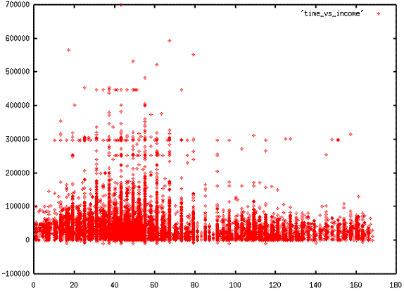
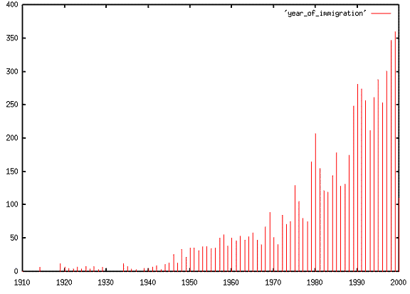

## Example - creating a scatter plot ##

Does the early bird get the worm? Let's look at the relationship between the 
time a person leaves for work and their income. Income is recorded in columns 
297-303, and the time a person leaves for work is recorded in columns 196-198, 
encoded in ten minute intervals. This pipeline extracts, cleans and formats the 
data:

```bash
$ cat pums_53.dat | grep "^P" | cut -c196-198,297-303 | grep -v "^000" | 
grep -v " $" | perl -pe 'substr($_,3,0)=" ";' > time_vs_income
```

The `grep`s knock out records for which either field is null, and the perl 
script inserts a space between the two columns so `gnuplot` can parse the 
columns apart. Plotting in gnuplot is simple:

```bash
$ gnuplot

        G N U P L O T
        Linux version 3.7 patchlevel 1
        last modified Fri Oct 22 18:00:00 BST 1999

Terminal type set to 'x11'
gnuplot> plot 'time_vs_income' with points
```

And the resulting plot:



Recall that 0 on the x-axis is midnight, and 20 is 200 minutes after midnight 
or about 3:20am. Increased density in the beginning of the traditional 1st and 
2nd shift periods is apparent. Folks who work regular business hours clearly 
have higher incomes. It would be interesting to compute the average income in 
each time bucket, but that makes a pretty hairy command line perl script. Here 
is it in all its gruesome glory:

```bash
$ cat pums_53.dat | grep "^P" | cut -c196-198,297-303 | grep -v "^000" | 
grep -v " $" | perl -ne '/(\d{3})(\d{7})/; $sum{$1}+=$2; $count{$1}++; END { foreach $k
(keys(%count)) {print $k," ",$sum{$k}/$count{$k},"\n"}}' | sort -n > time_vs_avgincome
```

You can plot the result for yourself if you're curious.

## Example - Creating a bar chart with gnuplot ##

Let's look at historic immigration rates among Washingtonians. Year of 
immigration is recorded in columns 78-81, and 0000 means the person is a native 
born citizen. We can apply the usual tricks with `cut`, `grep`, `sort`, and 
`uniq`, but it's a bit hard to see the patterns when scrolling back and forth 
in text output, it would nicer if we could see a plot.

```bash
$ cat pums_53.dat | grep "^P" | cut -c78-81 | grep -v 0000 | sort | uniq -c | head -10
 2 1910
 7 1914
12 1919
 7 1920
 6 1921
 5 1922
 7 1923
 5 1924
 8 1925
```

Gnuplot is a fine graphing tool for this purpose, but it wants the category 
label to come first, and the count to come second, so we need to write a perl 
script to reverse `uniq`'s output and stick the result in a file. See 
`perlrun(1)` for details on the `-a` and `-F` options to perl.

```bash
$ cat pums_53.dat | grep "^P" | cut -c78-81 | grep -v 0000 | sort | uniq -c |
perl -lape 'chomp $F[-1]; $_ = join " ", reverse @F' > year_of_immigration
```

Now we can make a bar chart from the contents of the file with gnuplot.

```bash
gnuplot> plot 'year_of_immigration' with impulses
```

Here's the graph gnuplot creates:



Be a bit careful interpreting this plot, only people who are still alive can be 
counted, so it naturally goes up and to the right (people who immigrated more 
recently have a better chance of still being alive). That said, there seems to 
have been an increase in immigration after the end of World War II, and also a 
spike after the end if the Vietnam war. I remain at a loss to explain the spike 
around 1980, consult your local historian.

## External Links ##

*   [Several demos of GnuPlot](http://gnuplot.sourceforge.net/demo/)

